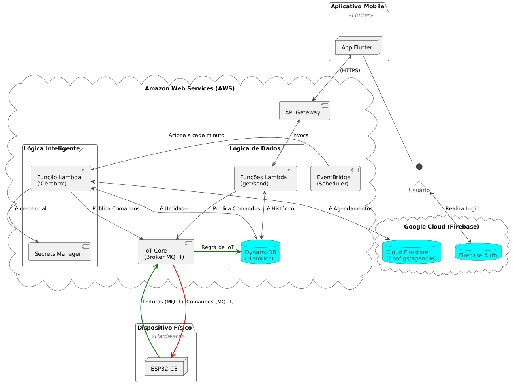

# Sistema de Irrigação Inteligente (IoT + AWS + Flutter)

Repositório do projeto de um sistema de irrigação inteligente ponta a ponta, demonstrando habilidades em IoT, desenvolvimento de firmware, arquitetura de nuvem híbrida (AWS + Google Cloud) e desenvolvimento de aplicativos mobile com Flutter.

---

### História do Projeto

Este projeto representa a **Versão 2.0** de um sistema originalmente concebido e apresentado no meu Trabalho de Conclusão de Curso (TCC) para a graduação em Análise e Desenvolvimento de Sistemas pelo IFSul. A versão inicial, que pode ser acessada na biblioteca da instituição, utilizava uma interface web desenvolvida com PHP e o framework Laravel.

Esta nova versão é uma evolução completa, reconstruída com o objetivo de aplicar tecnologias de ponta e melhores práticas de mercado. A principal melhoria foi a substituição da interface web por um **aplicativo mobile completo e reativo, desenvolvido em Flutter**, e a reestruturação de todo o backend para uma arquitetura de nuvem híbrida e escalável.

* **Acesse o TCC original aqui:** [Trabalho de Conclusão de Curso - Sistema de Irrigação Automatizado](https://biblioteca.ifsul.edu.br/pergamumweb/downloadArquivo?vinculo=MTlDRDIzOVkyOWtSVzF3Y21WellUMDBOREltWVdObGNuWnZQVFk1T0Rrd0puTmxjVkJoY21GbmNtRm1iejB4Sm5ObGNWTmxZMkZ2UFRnbWEyRnlaR1Y0UFU0bWJHOWpZV3hCY25GMWFYWnZQVU5QVFZCQlVsUkpURWhCVFVWT1ZFOG1ibTl0WlVOaGJXbHVhRzg5TURBd01EWTBMekF3TURBMk5EY3dMbkJrWmc9PTYwQkM2Qzg=&nomeExtensao=.pdf)

---
### Principais Funcionalidades

* **📱 Controle Total via App Mobile:** Interface de usuário completa desenvolvida em Flutter para gerenciamento remoto de todas as funcionalidades do sistema.
* **💧 Monitoramento em Tempo Real:** Dashboard principal que exibe a leitura de umidade mais recente do sensor, com atualização automática e configurável.
* **👆 Acionamento Manual:** Possibilidade de ligar a irrigação instantaneamente através de um comando no aplicativo, com duração personalizável.
* **🧠 Agendamentos Inteligentes:** Crie, edite e ative agendamentos de irrigação (por hora e dias da semana). A lógica na nuvem (AWS Lambda + Firestore) só aciona a válvula se a umidade do solo estiver abaixo de um limiar definido pelo usuário.
* **📊 Histórico de Leituras:** Visualização de todas as leituras de umidade registradas pelo dispositivo, com um sistema de paginação ("carregar mais") para lidar com grandes volumes de dados de forma eficiente.
* **🔍 Transparência do Sistema:** Relatório de ações ignoradas, que informa ao usuário todos os agendamentos que não foram executados e o motivo (ex: "umidade já estava acima do limite"), garantindo confiança na automação.

### Arquitetura do Sistema

Este projeto foi construído sobre uma arquitetura de nuvem híbrida, utilizando os pontos fortes da Amazon Web Services (AWS) para a gestão de dados de IoT e do Google Cloud (Firebase) para a autenticação e gerenciamento da lógica do aplicativo.

O fluxo de dados é totalmente "serverless", garantindo escalabilidade, segurança e baixo custo operacional.

### Tecnologias Utilizadas (Tech Stack)

A construção deste projeto envolveu uma gama diversificada de tecnologias de ponta, abrangendo desde o hardware embarcado até a nuvem e o desenvolvimento mobile.

**Hardware & Firmware**
* **Microcontrolador:** ESP32-C3-MINI-1
* **Sensor:** AHT10 (Umidade e Temperatura)
* **Linguagem (Firmware):** C++ (utilizando o framework Arduino)
* **Sistema Operacional:** FreeRTOS para gerenciamento de tarefas em tempo real.

**Nuvem & Backend (Arquitetura Híbrida)**
* **Amazon Web Services (AWS):**
    * `AWS IoT Core`: Broker MQTT para ingestão de dados do dispositivo.
    * `AWS Lambda`: Para a API REST e a lógica de agendamento (escrito em **Python**).
    * `Amazon DynamoDB`: Banco de dados NoSQL para armazenamento do histórico de leituras.
    * `Amazon API Gateway`: Para a criação e gerenciamento da API REST.
    * `Amazon EventBridge`: Scheduler para acionamento periódico da lógica inteligente.
    * `AWS Secrets Manager`: Para armazenamento seguro de credenciais.
* **Google Cloud Platform (Firebase):**
    * `Firebase Authentication`: Para autenticação de usuários no aplicativo.
    * `Cloud Firestore`: Banco de dados NoSQL para armazenar perfis de usuário, configurações e agendamentos.

**Aplicativo Mobile (Frontend)**
* **Framework:** Flutter
* **Linguagem:** Dart
* **Gerenciamento de Estado:** StreamBuilder e StatefulWidget para uma UI reativa.
* **Comunicação:** Pacote `http` para consumo da API REST.

### Roadmap e Futuras Melhorias

Este projeto é uma plataforma funcional e robusta, mas está em constante evolução. Abaixo estão listadas algumas das principais funcionalidades e melhorias planejadas para futuras versões, focadas em tornar o sistema ainda mais inteligente, confiável e escalável.

**Inteligência do Sistema**
* **[ ] Integração com API de Previsão do Tempo:**
    * O sistema consultará uma API meteorológica para verificar a probabilidade de chuva antes de executar um agendamento, evitando o desperdício de água.
* **[ ] Suporte a Múltiplos Sensores:**
    * Expandir o hardware para incluir sensores adicionais (ex: sensor de chuva, luminosidade UV, temperatura do solo), permitindo que a lógica de decisão se torne ainda mais precisa.
* **[ ] Dashboard de Análise Histórica:**
    * Criar uma nova tela no aplicativo para visualizar gráficos sobre o histórico de umidade e frequência de irrigação, ajudando o usuário a entender padrões de consumo.

**Robustez e Escalabilidade**
* **[ ] Modo de Operação Offline:**
    * Implementar uma lógica no firmware para que ele armazene localmente os agendamentos, garantindo que a irrigação programada ocorra mesmo em caso de falha na conexão com a internet.
* **[ ] Atualizações de Firmware Over-the-Air (OTA):**
    * Implementar um sistema de atualização remota para o ESP32, permitindo que novas funcionalidades e correções de segurança sejam enviadas pela internet, sem a necessidade de acesso físico ao dispositivo.
* **[ ] Suporte a Múltiplos Dispositivos (Zonas):**
    * Evoluir a arquitetura para permitir que um único usuário gerencie vários dispositivos ESP32, controlando diferentes "zonas" de irrigação a partir do mesmo aplicativo.

**Qualidade de Código e Automação (DevOps)**
* **[ ] Refatoração Contínua e Testes Automatizados:**
    * Implementar uma suíte de testes (unitários e de integração) e refatorar o código continuamente para melhorar a performance, robustez e manutenibilidade.
* **[ ] Pipeline de CI/CD (Integração e Deploy Contínuos):**
    * Automatizar o processo de testes e deploy de novas versões utilizando ferramentas como GitHub Actions, garantindo que novas funcionalidades cheguem ao usuário de forma mais rápida e segura.

**Experiência do Usuário (UX/UI)**
* **[ ] Integração com Assistentes de Voz (Amazon Alexa):**
    * Desenvolver uma "Alexa Skill" personalizada que permita ao usuário controlar a irrigação através de comandos de voz (ex: "Alexa, ligar o irrigador por 5 minutos"), integrando diretamente com o backend na AWS.
* **[ ] Notificações Push para o Usuário:**
    * Enviar notificações para o aplicativo sempre que uma irrigação for iniciada ou ignorada.
* **[ ] Suporte Multi-plataforma (Web & iOS):**
    * Aproveitar o poder do Flutter para compilar e adaptar a base de código existente, criando uma versão web para acesso via desktop e uma versão para iOS.
* **[ ] Implementação de Tema Escuro (Dark Mode):**
    * Adicionar a opção de um tema escuro na interface do aplicativo para melhorar a experiência de uso.   ///